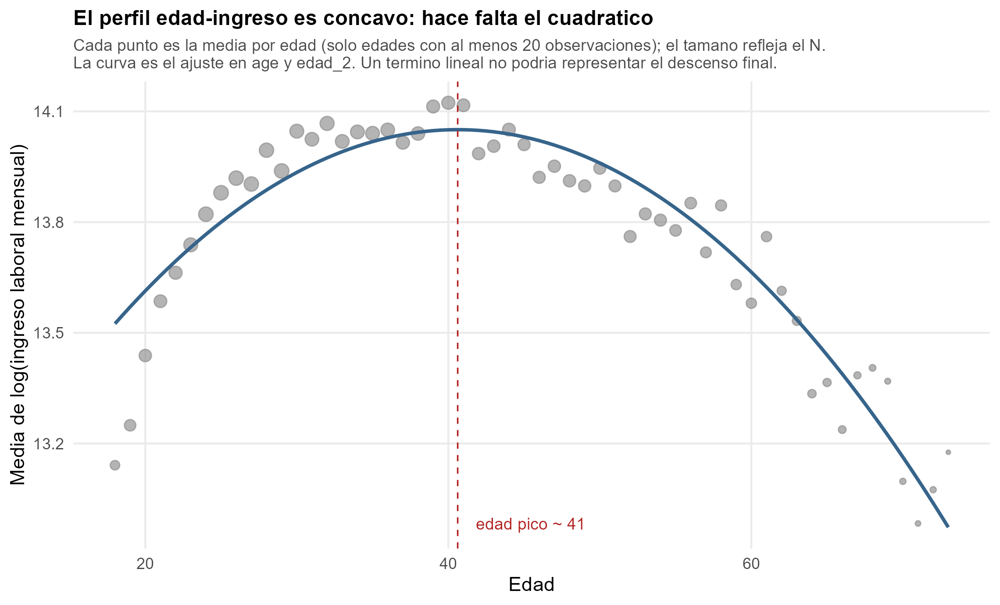
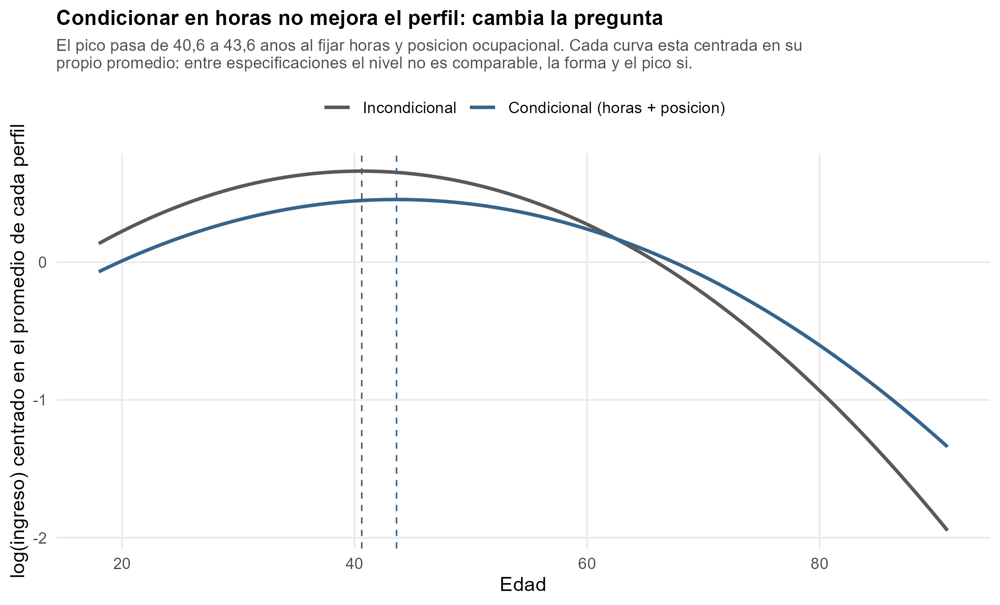
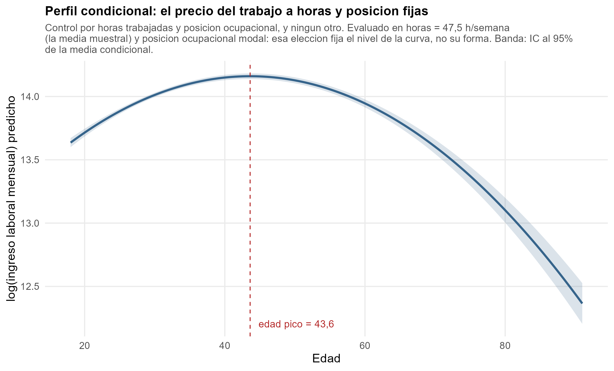

## Result Overview

\textbf{El ingreso laboral mensual alcanza su máximo a los \PicoIncond\ años}
(IC 95\% bootstrap: \ICIncond).

Controlando por horas trabajadas y posición ocupacional, el máximo se corre a
los \textbf{\PicoCond\ años} (IC 95\%: \ICCond).

- Las dos edades pico caen **dentro** del rango de edad observado
  (\RangoEdad\ años): son interpolación, no extrapolación.
- Los dos intervalos **no se solapan**. El desplazamiento de \DesplazaPico\
  años no es ruido muestral.
- Ese desplazamiento es el hallazgo de la sección: al fijar las horas
  desaparece la parte del descenso que venía de trabajar menos, no de valer
  menos por hora.

\vfill
\footnotesize GEIH 2018, Bogotá. N = \NMuestra\ ocupados de 18 años o más.

## Pregunta y motivación

**¿Cómo varía el ingreso laboral a lo largo del ciclo de vida, y a qué edad
llega a su máximo?**

La teoría de capital humano (Mincer) predice un perfil **cóncavo**:

- Al principio la inversión en capital humano es alta y el ingreso observado
  bajo: se sacrifica salario presente por productividad futura.
- Esa inversión rinde durante décadas y el ingreso sube.
- El horizonte para amortizarla se acorta, la inversión nueva cae y la
  depreciación pasa a dominar: el perfil se aplana y después baja.

El máximo está donde el retorno marginal de la experiencia iguala a la
depreciación. Para una autoridad tributaria no es un dato de curiosidad:
define contra qué perfil comparar un ingreso reportado.

## Evidencia descriptiva: el perfil es cóncavo

{width=88%}

\footnotesize La concavidad es una **predicción contrastable**, no un supuesto:
si el cuadrático fuera positivo o indistinguible de cero, la edad pico sería un
mínimo o puro ruido. Sale negativo y muy significativo en las dos
especificaciones (t = \TIncond\ y t = \TCond).

## Especificaciones

**(1) Incondicional**
$$\log(w_i) = \beta_1 + \beta_2\,\text{age}_i + \beta_3\,\text{age}_i^2 + u_i$$

**(2) Condicional**
$$\log(w_i) = \beta_1 + \beta_2\,\text{age}_i + \beta_3\,\text{age}_i^2 +
\gamma\,\text{totalHoursWorked}_i + \delta'\text{relab}_i + u_i$$

Y **ningún otro control**: el enunciado lo fija así, y un regresor de más no
sería una mejora sino otra especificación.

**Edad pico** $= -\beta_2 / (2\beta_3)$, evaluada en las dos.

\footnotesize
Las dos se estiman sobre la muestra **completa** (\NMuestra), no sobre el fold
de entrenamiento: la Sección 1 describe un perfil poblacional. `relab` entra
como `relab_grupo`, que pliega el nivel 8 (una sola observación) en el 9.

## El intervalo de la edad pico va por bootstrap

La edad pico **no es un coeficiente**: es la razón $-\beta_2 / (2\beta_3)$, una
función no lineal de dos coeficientes correlacionados.

- `lm()` no reporta el error estándar de una razón.
- El **método delta** linealiza alrededor de las estimaciones y se degrada a
  medida que el denominador $2\beta_3$ se acerca a cero. Aquí $\beta_3$ es
  pequeño y negativo: la razón tiene cola pesada y el intervalo delta quedaría
  demasiado angosto.
- La distribución muestral de una razón **no es simétrica**. El delta impone
  esa simetría por construcción; el bootstrap no.

**Procedimiento**: 1.000 réplicas; en cada una se remuestrean filas con
reemplazo, se **reajusta el modelo completo** y se recalcula la razón con los
coeficientes de esa réplica. Percentiles 2,5 y 97,5; semilla 1234. Cada
especificación tiene su propio bootstrap.

## Resultados

<!-- La tabla es un flotante: no se puede partir entre láminas, así que su
     nota tiene que caber. La nota del .tex se mantiene en dos líneas y el
     desarrollo metodológico va en las láminas siguientes. -->

\scriptsize
\input{../views/tables/perfiles_edad.tex}

## Los dos perfiles

\footnotesize Cada curva está centrada en su propio promedio: entre
especificaciones el nivel no es comparable, la forma y la posición del pico si.

## El perfil condicional

## Condicionar en horas no mejora el perfil: cambia la pregunta

`totalHoursWorked` es un **bad control** para esta pregunta. Las horas no son
una característica predeterminada de la persona: son una decisión que responde
a la edad. Condicionar en ellas **cierra uno de los canales** por los que la
edad afecta al ingreso mensual, en vez de aislar un efecto más limpio.

Las dos columnas estiman **objetos distintos**:

- **(1)** el perfil del *ingreso laboral mensual observado*: lo que una persona
  efectivamente gana en el mes, que incorpora tanto el precio de su hora como
  cuántas horas trabaja y en qué posición.
- **(2)** el perfil del *precio del trabajo a horas y posición fijas*: cuánto
  cambia el ingreso con la edad **entre** personas que trabajan lo mismo.

La (2) no es la versión corregida de la (1): responde otra pregunta.

## Por qué el pico se corre hacia adelante

El pico pasa de \PicoIncond\ a \PicoCond\ años: \textbf{se retrasa \DesplazaPico\ años} al fijar horas y posición. La dirección es la que predice el mecanismo:

- Las horas **caen con la edad**: \HorasJovenes\ h/semana entre los 18 y los
  45 años, \HorasMayores\ h/semana de los 66 en adelante.
- Cada hora semanal adicional vale \CoefHoras\ log points de ingreso mensual.
- Parte del descenso observado después de los 40 no es una caida del
  **precio** del trabajo: es gente trabajando **menos horas**.

Al fijar las horas ese componente sale del perfil. **La (1) hace ver el
declive antes de lo que le corresponde al salario**, porque le suma la
reducción de la oferta laboral.

## Advertencia sobre el ajuste in-sample

$R^2$: \RCuadIncond\ en (1) y \RCuadCond\ en (2).

**Esa subida no es evidencia de que (2) esté mejor especificada.** El $R^2$ no
puede bajar al agregar regresores a la misma variable dependiente: sube por
construcción. Que las horas trabajadas expliquen varianza del ingreso mensual
era de esperarse y no valida la elección de controles.

Las dos especificaciones **no compiten**: responden preguntas distintas, y cuál
interesa depende de si se quiere el perfil del ingreso observado o el del
precio del trabajo.

## Conclusión

1. El perfil edad-ingreso es **cóncavo**, como predice la teoría de capital
   humano: el termino cuadrático es negativo y muy significativo en las dos
   especificaciones.
2. El ingreso laboral mensual llega a su máximo a los \textbf{\PicoIncond\ años}
   (IC 95\%: \ICIncond), dentro del rango observado (\RangoEdad).
3. A horas y posición ocupacional fijas el máximo se corre a los
   \textbf{\PicoCond\ años} (IC 95\%: \ICCond). Los intervalos no se solapan.
4. La diferencia de \DesplazaPico\ años mide **cuánto del declive observado es
   oferta laboral y no precio del trabajo**.

**Limitación**: la muestra excluye \ExcluidasIngreso\ ocupados adultos sin
ingreso laboral observado (\PctExcluidasIngreso\%). El ingreso faltante se
excluye, nunca se imputa: imputarlo exigiría un modelo de ingreso, que es
justamente el objeto de estimación.

<!-- NOTA DE REPRODUCCION -------------------------------------------------

Este deck NO calcula nada: solo incluye tablas y figuras que ya produjo el
pipeline. Antes de renderizarlo hay que correr, desde la raiz del proyecto:

    Rscript scripts/99_run_all.R

Eso deja las figuras en `views/figures/` y las tablas en `views/tables/`.
Con `stores/raw/` en disco la corrida completa toma 1 min 29 s medidos; los
dos bootstrap de esta sección (1.000 réplicas cada uno) son ~28 s de ese
total. Desde un clone limpio hay que sumarle la descarga de ~227 MB de HTML
crudo.

Ninguna cifra se transcribe a mano. Las del texto entran como macros de LaTeX
desde `views/tables/cifras_age.tex`, que escribe `10_age_profile.R`: si la
muestra cambia, las láminas cambian solas. La muestra de referencia es siempre
la misma: N = 14.751 observaciones, la que produce
`construir_muestra_analisis()` en `scripts/02_cleaning.R`. Si una cifra de
estas láminas no se puede rastrear hasta una corrida, es un error.

Si `02_cleaning.R` advierte que `muestra_analisis.rds` se construyo con reglas
de limpieza distintas, hay que regenerarlo ANTES de renderizar: de lo
contrario las láminas quedan describiendo una muestra que ya no existe.

Insumos de esta sección:
  * scripts/10_age_profile.R
  * views/tables/cifras_age.tex             (macros con las cifras del texto)
  * views/tables/perfiles_edad.tex          (tabla de regresión)
  * views/figures/ingreso_por_edad.png      (perfil incondicional y concavidad)
  * views/figures/perfil_edad_condicional.png
  * views/figures/perfiles_edad_comparacion.png
  * views/figures/dist_ingreso_log.png      (por qué el outcome va en logs)
--------------------------------------------------------------------- -->
