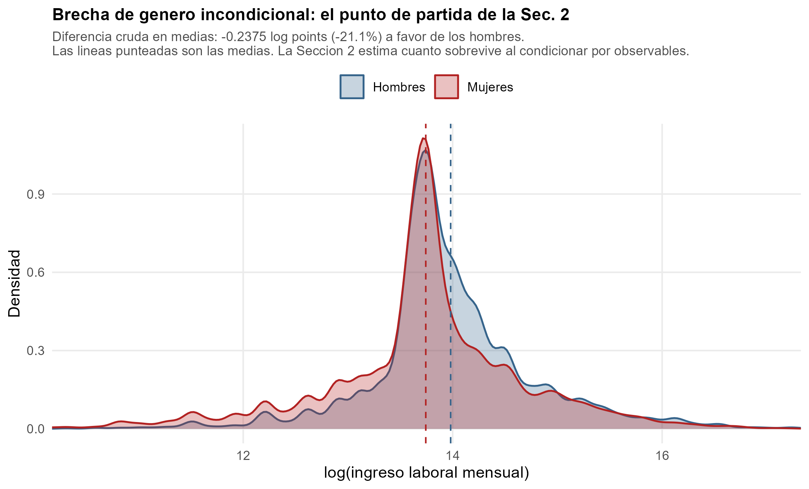
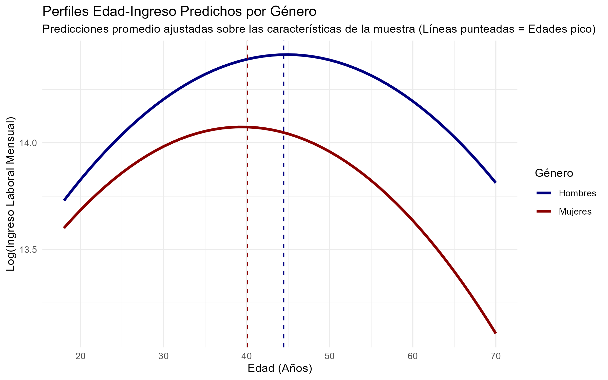

## Result Overview

\textbf{Las mujeres ganan \BrechaCrudaPct\% menos que los hombres}
(\BrechaCruda\ log points, sin controles).

Al condicionar por edad, educación y estrato la brecha **se agranda** a
\textbf{\BrechaCondPct\%} (\BrechaCond\ log points).

- La brecha condicional es **más grande**, no más chica. Las mujeres de la
  muestra están **más educadas** (\PctSuperiorMujeres\% con superior
  frente a \PctSuperiorHombres\%): al compararlas a educación igual, la
  desventaja que queda es mayor.
- Errores estándar prácticamente idénticos por las dos vias: analítico HC1
  \SEAnalitico\ y bootstrap \SEBootstrap\ (\BootRepsGap\ réplicas).
- El pico del perfil edad-ingreso llega \textbf{\PicoHombres\ años en hombres} y
  \textbf{\PicoMujeres\ en mujeres}: los intervalos no se solapan.

\vfill
\footnotesize GEIH 2018, Bogotá. N = \NGap\ ocupados de 18 años o más.

## Pregunta y motivación

**¿Cuanto menos gana una mujer que un hombre en Bogotá, y cuánto de esa
diferencia sobrevive al comparar personas observacionalmente parecidas?**

La respuesta depende por completo de **que se controla**, y esa es la decisión
metodológica central de la sección. No hay un conjunto de controles neutral:

- Controlar **de menos** deja dentro diferencias de composición que no son
  trato desigual.
- Controlar **de más** absorbe justamente los canales por los que opera la
  desigualdad, y hace desaparecer lo que se quería medir.

Para la autoridad tributaria: si el ingreso esperado depende del sexo, un
modelo que lo ignore yerra sistemáticamente en media población.

## Evidencia descriptiva: la brecha cruda

{width=88%}

\footnotesize La diferencia de medias en logaritmos es \BrechaCruda, es decir
\BrechaCrudaPct\%. Es el punto de partida, no el resultado: no distingue entre
trato desigual y diferencias de composición.

## Especificaciones

**(1) Incondicional**
$$\log(w_i) = \beta_1 + \beta_2\,\text{mujer}_i + u_i$$

**(2) Condicional — preferida**
$$\log(w_i) = \beta_1 + \beta_2\,\text{mujer}_i + \gamma'X_i + u_i$$
con $X_i$ = edad, edad$^2$, educación y estrato.

**(3) Con controles de puesto**: agrega oficio, tamaño de empresa y posición
ocupacional.

\vspace{0.3em}
El coeficiente de interés es siempre $\beta_2$. En (2) se estima además por
**FWL**, con errores estándar analíticos (HC1) y bootstrap.

## Por qué esos controles, y no otros

| Control | Por qué entra |
|---|---|
| Edad, edad$^2$ | Experiencia potencial. No la elige la persona. |
| Educación | Capital humano, casi todo previo al mercado. |
| Estrato | Proxy de origen socioeconómico y de redes. |

**Los tres son anteriores al empleo actual.** Esa es la regla que aplicamos:
condicionar en características **predeterminadas** de la persona, no en
resultados del mercado laboral.

\footnotesize La educación es el control más discutible: estudiar
anticipa un retorno que ya incorpora la discriminación.

## Los bad controls: oficio, tamaño de empresa y posición

La especificación (3) agrega oficio, tamaño de empresa y posición ocupacional,
y la brecha **se encoge** a \BrechaBadControls.

**Esa caida no es una mejora: es el sintoma.** Esas tres variables no son
rasgos de la persona, son **resultados** del mercado laboral, y están entre los
canales por los que opera la desigualdad de género:

- La **segregación ocupacional** — que las mujeres se concentren en oficios
  peor pagados — es *parte de* la brecha, no una explicación alternativa.
- Lo mismo con acceder a empresas grandes o a posiciones formales.

Condicionar en ellas responde una pregunta mucho más estrecha: *dado que ya
está en el mismo oficio, la misma empresa y la misma posición, ¿cuánto menos
gana?* Esa pregunta ignora cómo llegó ahí.

**Por eso (2) es la preferida y (3) se reporta como contraste.**

## Resultados

\scriptsize
\input{../views/tables/brecha_compacta.tex}

## Por qué FWL recupera el mismo coeficiente

FWL da **exactamente** el mismo $\beta_2$ que la regresión multiple. No es
coincidencia numérica: es la geometría de MCO.

**Procedimiento**: (i) se regresa `mujer` contra $X$ y se guarda el residuo
$\tilde{m}$; (ii) se regresa $\log(w)$ contra $X$ y se guarda su residuo;
(iii) se regresa el segundo residuo contra $\tilde{m}$.

**Por qué funciona.** MCO proyecta $\log(w)$ sobre el espacio generado por
todos los regresores. El coeficiente de `mujer` en la regresión multiple usa
solo la parte de `mujer` **ortogonal a $X$**: la variación en sexo que no
explican edad, educación ni estrato. Residualizar hace explicito ese mismo
paso. Los dos procedimientos usan idéntica información, de modo que llegan al
mismo número.

\footnotesize Verificado: los dos coeficientes coinciden en las siete
cifras que imprime el pipeline.

## Los dos errores estándar coinciden

| Método | Error estándar de $\hat\beta_{\text{mujer}}$ |
|---|---|
| Analítico, HC1 robusto | \SEAnalitico |
| Bootstrap, \BootRepsGap\ réplicas | \SEBootstrap |

**Coinciden hasta la cuarta cifra.** Eso no es trivial y es informativo: el
bootstrap no impone la forma funcional de la matriz de varianzas, de modo que
su acuerdo con HC1 dice que las condiciones asintóticas de MCO se cumplen bien
en esta muestra.

Si hubieran discrepado, el sospechoso natural sería la heterocedasticidad
severa o las colas pesadas del ingreso. Con N = \NGap\ y el outcome en
logaritmos, ninguna de las dos muerde.

## Perfiles edad-ingreso por sexo

{width=88%}

\footnotesize
Edad pico: \textbf{hombres \PicoHombres\ años} (IC 95\% \ICPicoHombres),
\textbf{mujeres \PicoMujeres\ años} (IC 95\% \ICPicoMujeres). Bootstrap de
percentiles, \BootRepsGap\ réplicas, remuestreando filas y reajustando el
modelo completo en cada una.

## Los picos no se solapan, y eso dice algo

Los intervalos \textbf{\ICPicoHombres} y \textbf{\ICPicoMujeres} están separados: la
diferencia de más de cuatro años no es ruido muestral.

**Interpretación.** El perfil femenino no solo está más abajo: llega a su
máximo **antes** y empieza a decaer **antes**. Con el ciclo de vida laboral eso
es consistente con:

- interrupciones de carrera concentradas en la treintena, que truncan la
  acumulación de experiencia justo en el tramo de mayor retorno;
- retorno posterior a empleos que no reconocen la experiencia previa.

La brecha, entonces, **no es un nivel constante**: se abre con la edad. Un
modelo que la resuma en un solo coeficiente promedia dos perfiles que divergen.

## Limitación: selección por no respuesta de ingreso

La muestra excluye \NExcluidos\ ocupados sin ingreso observado. El DANE
imputa ingreso a \NImputados de ellos, y ese grupo está **sesgado hacia los
hombres**: \PctHombresImputados\% frente a \PctHombresMuestra\% en la muestra.

Eso permite **acotar** el sesgo:

| Muestra | $N$ | Brecha cruda |
|---|---|---|
| Base (ingreso observado) | \NGap | \BrechaCruda |
| Ampliada con `impaes` | \NAmpliada | \BrechaAmpliada |

La brecha se mueve \textbf{\DesplazaBrecha} log points: se vuelve *más*
negativa. La observada **subestima** la desventaja femenina, de modo que la
selección **no compromete el resultado**.

\footnotesize Análisis de sensibilidad, no cota formal.

## Conclusión

1. La brecha cruda es \textbf{\BrechaCruda} log points (\BrechaCrudaPct\%).
2. Condicionando por edad, educación y estrato **se agranda** a
   \textbf{\BrechaCond}: a características predeterminadas iguales la
   desventaja es mayor, porque las mujeres están más educadas.
3. Agregar oficio, empresa y posición la baja a \BrechaBadControls. **Esa
   caida mide segregación ocupacional**, que es parte de la brecha.
4. Picos por sexo separados (\PicoHombres\ vs. \PicoMujeres\ años): la
   brecha **se abre con la edad**.
5. Corregir la no respuesta con la imputación del DANE **agranda** la brecha
   (\DesplazaBrecha).

<!-- NOTA DE REPRODUCCION -------------------------------------------------

Este deck NO calcula nada: solo incluye tablas y figuras que ya produjo el
pipeline. Antes de renderizarlo hay que correr, desde la raiz del proyecto:

    Rscript scripts/99_run_all.R

Eso deja las figuras en `views/figures/` y las tablas en `views/tables/`.

Ninguna cifra se transcribe a mano. Las del texto entran como macros de LaTeX
desde `views/tables/cifras_gap.tex`, que escribe `20_gender_gap.R`: si la
muestra cambia, las láminas cambian solas. La muestra de referencia es siempre
la misma: N = 14.751 observaciones, la que produce
`construir_muestra_analisis()` en `scripts/02_cleaning.R`.

Si `02_cleaning.R` advierte que `muestra_analisis.rds` se construyo con reglas
de limpieza distintas, hay que regenerarlo ANTES de renderizar.

Insumos de esta sección:
  * scripts/20_gender_gap.R
  * views/tables/cifras_gap.tex            (macros con las cifras del texto)
  * views/tables/tabla_brecha_genero.tex   (tabla de regresión)
  * views/figures/ingreso_por_genero.png   (la brecha cruda)
  * views/figures/perfil_edad_ingreso.png  (perfiles por sexo con picos)
  * document/notas_pulso.md                (detalle de la selección)
--------------------------------------------------------------------- -->
