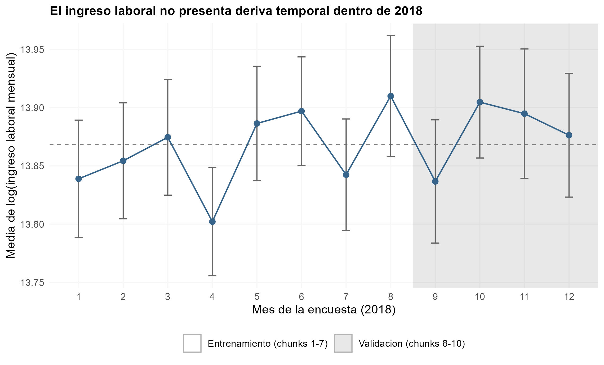
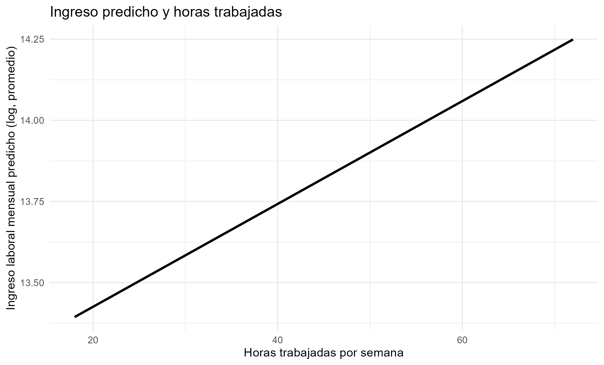

## Result Overview

\textbf{El mejor modelo es el \ModeloGanador, con RMSE de validación \RMSEGanador.}

Reduce el error del modelo nulo en \textbf{\ReduccionGanador\%}.

- El **perfil de edad de la Sección 1 casi no predice**: RMSE
  \RMSESUnoIncond\ contra \RMSENulo\ del modelo nulo, apenas
  \textbf{\ReduccionSUnoIncond\%} de reducción.
- La variable más importante es \textbf{\VarImportante}: quitarla sube el RMSE en
  \ImportanciaTop.
- LOOCV sobre entrenamiento da \RMSELoocv, **mejor** que el RMSE de validación
  (\BrechaLoocv). La diferencia no es sobreajuste: son periodos distintos.

\vfill
\footnotesize GEIH 2018, Bogotá. Entrenamiento: chunks 1-7 (N = \NTrain).
Validación: chunks 8-10 (N = \NValidacion).

## Pregunta y motivación

**¿Qué tan bien se puede predecir el ingreso laboral de una persona, y dónde
fallan las predicciones?**

Esta sección cambia el objetivo. En las Secciones 1 y 2 el interés estaba en
**interpretar** un coeficiente; aquí está en \textbf{acertarle a $\log(w)$} en gente
que el modelo no vio.

Para una autoridad tributaria la diferencia es operativa: no le sirve saber que
el ingreso sube con la edad, le sirve poder decir *"esta persona reporta mucho
menos de lo que su perfil predice"*.

Ese es el eje del problem set: **lo interpretable y lo predictivo no son lo
mismo**, y esta sección lo mide.

## El corte es temporal, no aleatorio

- **`mes` y `chunk_id` no pueden ser predictores**: cualquiera de los dos
  filtra la partición y el RMSE dejaría de medir error fuera de muestra.
- Leerlo como error fuera de muestra ordinario exige que **no haya salto de
  nivel** entre los dos folds.

## El corte es temporal, no aleatorio

{width=100%}

## Sin salto de diciembre

La sospecha natural es la **prima de servicios**: si diciembre trajera un salto
de ingreso, el fold de validación no sería comparable con el de entrenamiento.

**No lo hay.** Las dos especificaciones coinciden:

- Diciembre como dummy sola: $b =$ \CoefDicSolo\ ($p =$ \PDicSolo).
- Sobre una tendencia mensual: $b =$ \CoefDicTend\ ($p =$ \PDicTend).

Ninguna se distingue de cero, porque la prima ya entra en `y_total_m`
**mensualizada**.

\vspace{0.4em}
El mismo razonamiento vale para agrupar `oficio`: el umbral de 30
observaciones se calcula **solo sobre los chunks 1-7** y después se aplica a
los 8-10, para que el fold de validación nunca informe la codificación.

## Las cinco especificaciones

\small

Todas parten del baseline de la Sección 2 y agregan información de forma
progresiva y económicamente motivada.

| | Qué agrega | Por qué |
|---|---|---|
| **M1** | horas, posición | Cuánto trabaja y en qué relación |
| **M2** | antiguedad y su cuadrado | Retorno a la experiencia, no lineal |
| **M3** | tamaño de empresa, formalidad | Prima por tamaño y formalidad |
| **M4** | oficio (agrupado) | Diferencias entre ocupaciones |
| **M5** | mujer$\times$educ, edad$\times$educ | El retorno a educar varía |

\normalsize
\footnotesize Estimadas solo sobre entrenamiento; se eligen por RMSE de
validación.

## Colinealidad perfecta en el Modelo 5

Al revisar M5 aparecieron **coeficientes `NA`** en `cuenta_propia` y
`micro_empresa`. `alias()` confirma por qué:

- `cuenta_propia` es redundante con una categoría de la posición ocupacional.
- `micro_empresa` queda determinada por el intercepto y el tamaño de empresa.

**No son variables sin efecto: son combinaciones lineales exactas de columnas
que ya estaban.** Sus coeficientes no son identificables por separado.

Se retiran y se reestima el **Modelo 5 limpio**. Las predicciones son
**idénticas** — se verificó que el RMSE coincide en las diez cifras decimales —
de modo que la limpieza no cuesta capacidad predictiva: solo deja un modelo
interpretable.

## RMSE de validación: todas las especificaciones

\scriptsize
\input{../views/tables/rmse_pred.tex}

\normalsize
\vspace{-0.4em}
\footnotesize El **modelo nulo** predice a todos la media de entrenamiento. Es
el piso: un modelo que no le gane no aporta información.

## El hallazgo: interpretable no es predictivo

\textbf{El perfil edad-ingreso de la Sección 1 le quita al modelo nulo apenas \ReduccionSUnoIncond\% del error.}

Su RMSE (\RMSESUnoIncond) está a menos de tres centésimas de no usar **ningún**
regresor (\RMSENulo).

\vspace{0.4em}
Y sin embargo esa misma especificación produjo la edad pico de la Sección 1,
con un intervalo estrecho y una interpretación económica nitida.

**Las dos cosas son ciertas a la vez:**

- La edad **ordena bien el ingreso en promedio**: el perfil es real, cóncavo y
  se estima con precisión.
- La edad **casi no predice a nivel individual**: la varianza entre personas de
  la misma edad es de un orden mucho mayor que la que hay entre edades.

Esta es exactamente la tensión que plantea el enunciado, y aquí está medida.

## LOOCV contra validación

| Medida | Muestra | RMSE |
|---|---|---|
| Validación | chunks 8-10 (N = \NValidacion) | \RMSEGanador |
| LOOCV | entrenamiento (N = \NTrain) | \RMSELoocv |

\textbf{El LOOCV es \BrechaLoocv\ mejor.} Que el error dentro de muestra sea menor
no sorprende; lo informativo es **cuan poco** difieren.

- Si la brecha fuera grande, indicaría sobreajuste al periodo de
  entrenamiento.
- Al ser pequeña, dice que el modelo **generaliza a un periodo distinto**.

\footnotesize LOOCV usa el atajo exacto de MCO por leverage,
$e_{(-i)} = e_i / (1 - h_{ii})$, que da el resultado exacto sin reajustar el
modelo \NTrain\ veces.

## Cómo medimos importancia, y por qué así

**Definición.** La importancia de la variable $j$ es cuánto **empeora el RMSE
de validación** al sacarla:
$$\text{Importancia}_j = \text{RMSE}_{\sin j} - \text{RMSE}_{\text{completo}}$$

Se retira el **bloque completo** de terminos de esa variable — cuadrados e
interacciones incluidos — y se reestima sobre entrenamiento.

**Por qué esta medida y no otra.** El criterio de la sección es predictivo, de
modo que la importancia debe medirse en la misma moneda: error fuera de
muestra.

- El **valor $p$** mide precisión de un coeficiente, no aporte predictivo. Con
  N grande casi todo es significativo.
- El **coeficiente estandarizado** depende de la escala y no dice nada sobre
  error de predicción.

\footnotesize Es importancia **predictiva marginal dentro de esta
especificación**, no una afirmación causal.

## Ranking de importancia

\scriptsize
\input{../views/tables/importancia_pred.tex}

\normalsize
\vspace{-0.3em}
\footnotesize \textbf{\VarImportante} encabeza (\ImportanciaTop), seguida del
oficio (\ImportanciaSegunda). Coherente con el outcome: `y_total_m` es
ingreso **mensual**, no salario por hora.

## Cómo dependen las predicciones de las horas

{width=88%}

\footnotesize Para cada valor de horas se mantienen intactas las demás
características de validación, se reemplaza solo `horas` y se promedian las
predicciones. La recta es **lineal por construcción**: `horas` entra sin
cuadrados ni interacciones. Pendiente: \CoefHorasPred\ log points por hora
semanal.

## Donde fallan las predicciones

El modelo predice el ingreso de quien **reporta** ingreso. No puede senalar a
quien declara cero: esas personas **no están en la muestra de estimación**.

Son \NSinIngresoPred\ ocupados adultos a quienes el DANE si imputa ingreso, y
**no son un grupo cualquiera**: \PctIndepSinIngreso\% son independientes —
cuenta propia o patrones — es decir, gente cuyo ingreso no pasa por una nomina.

\vspace{0.4em}
**Para una autoridad tributaria ese es el punto ciego que importa.** El modelo
es útil para detectar sub-reporte *dentro* de la población que reporta; el
grupo con mayor riesgo de no reportar del todo queda, por construcción, fuera
de su alcance.

Ampliar la muestra a ese grupo exige un modelo de la decisión de reportar, que
es un problema distinto del de esta sección.

## Conclusión

1. El \textbf{\ModeloGanador} gana con RMSE \RMSEGanador, un \textbf{\ReduccionGanador\%}
   por debajo del modelo nulo.
2. **Interpretable no es predictivo**: el perfil de edad de la Sección 1 reduce
   el error apenas \ReduccionSUnoIncond\%, y aun así da una edad pico precisa e
   interpretable.
3. **LOOCV y validación casi coinciden** (\RMSELoocv\ vs. \RMSEGanador): el
   modelo generaliza a un periodo distinto, no está sobreajustado.
4. La variable más importante es \textbf{\VarImportante}, medida por aumento del
   RMSE de validación al retirarla.
5. **El punto ciego**: \NSinIngresoPred\ ocupados sin ingreso reportado,
   \PctIndepSinIngreso\% independientes, quedan fuera del alcance del modelo.

<!-- NOTA DE REPRODUCCION -------------------------------------------------

Este deck NO calcula nada: solo incluye tablas y figuras que ya produjo el
pipeline. Antes de renderizarlo hay que correr, desde la raiz del proyecto:

    Rscript scripts/99_run_all.R

Eso deja las figuras en `views/figures/` y las tablas en `views/tables/`.

Ninguna cifra se transcribe a mano. Las del texto entran como macros de LaTeX
desde `views/tables/cifras_pred.tex`, que escribe `30_prediction.R`: si la
muestra cambia, las láminas cambian solas. La muestra de referencia es siempre
la misma: N = 14.751 observaciones, la que produce
`construir_muestra_analisis()` en `scripts/02_cleaning.R`.

Las cifras de la lámina de diciembre entran como macros desde
`views/tables/cifras_deriva.tex`, que escribe `03_descriptives.R`.

Insumos de esta sección:
  * scripts/30_prediction.R
  * views/tables/cifras_pred.tex            (macros con las cifras del texto)
  * views/tables/rmse_pred.tex              (tabla de RMSE de validación)
  * views/tables/importancia_pred.tex       (ranking de importancia)
  * views/figures/deriva_temporal.png       (por qué el corte es temporal)
  * views/figures/dependencia_horas.png     (dependencia de las predicciones)
--------------------------------------------------------------------- -->
